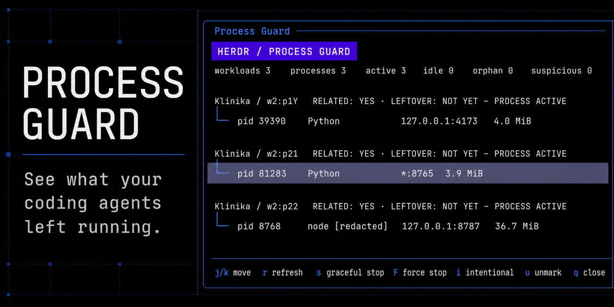
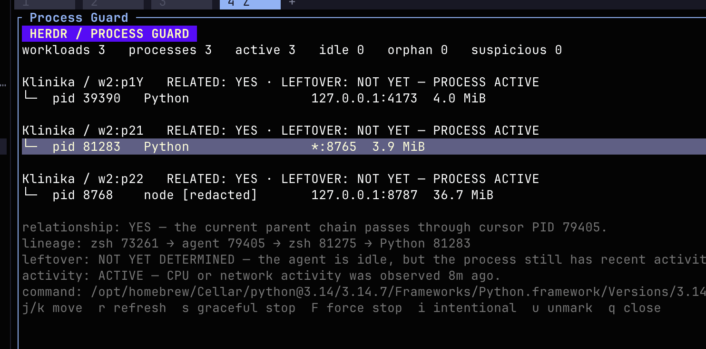

# Process Guard

<p align="center">
  
</p>

<p align="center">
  <strong>See what your coding agents left running—before you kill the wrong thing.</strong>
</p>

<p align="center">
  <a href="https://github.com/Efeguclu1/herdr-process-guard/actions/workflows/ci.yml"></a>
  <a href="LICENSE"></a>
  <a href="https://herdr.dev/docs/cli-reference/#plugins"></a>
  
</p>

Coding agents start dev servers, test runners, browser workers, and background
helpers. Some stay alive after the task ends. Process Guard attributes those
processes to the exact Herdr workspace, tab, pane, and coding agent; explains
why they are active or suspected leftovers; and previews the complete process
tree before anything is stopped.

It is not a generic process cleaner. It is an **agent process inspector and
lifecycle guard**.

## Install

Requirements: macOS and [Herdr 0.8.0+](https://herdr.dev/). Tagged installs
download a release binary; Go 1.24+ is only required for source development or
as an installation fallback.

```sh
herdr plugin install Efeguclu1/herdr-process-guard --yes
herdr plugin pane open --plugin herdr.process-guard --entrypoint dashboard
```

Run a read-only audit without opening the dashboard:

```sh
herdr plugin action invoke audit --plugin herdr.process-guard
```

For local development:

```sh
git clone https://github.com/Efeguclu1/herdr-process-guard.git
cd herdr-process-guard
herdr plugin link "$PWD"
herdr plugin pane open --plugin herdr.process-guard --entrypoint dashboard
```

## What it answers

For every attributed workload, Process Guard separates four questions:

- **Related?** Does the current parent chain pass through an agent, or was the
  process observed during a recorded agent activity window?
- **Where?** Which human-readable workspace and tab created it?
- **Active?** Is the agent working, is a connection established, or did
  meaningful CPU/network activity occur recently?
- **Leftover?** Has the agent stopped while the workload remained idle long
  enough to become a safe review candidate?

<p align="center">
  
</p>

The screenshot is an authentic development capture from a live Herdr session.
Commands are summarized or redacted in the dashboard; raw command lines remain
local.

## Safety model

Process Guard never cleans automatically.

1. Discovery and classification are read-only.
2. A process needs repeated observations and a mature safety window before it
   can become a leftover candidate.
3. Protected shells, coding agents, and Process Guard itself are never stop
   targets.
4. Every stop begins with a fresh PID/start-time identity check and a complete
   tree preview.
5. Graceful stop sends `SIGTERM` only. It never silently escalates.
6. Force stop is a separate, typed confirmation and only applies to identities
   that survived a recent Process Guard graceful-stop attempt.

Read the complete [safety model](docs/SAFETY.md).

## Why not `lsof`, Activity Monitor, or `pkill`?

Those tools show processes. They do not know which coding agent, Herdr tab, or
agent lifecycle interval created them. Process Guard keeps that provenance and
shows the blast radius before signaling a tree.

Traditional orphan cleaners often wait for `PPID=1`. Agent leftovers can still
be descendants of a live but idle agent, so they are not Unix orphans yet.
Process Guard can explain these earlier without assuming they should be killed.

## Classification

| Label | Meaning |
| --- | --- |
| `RELATED: YES` | The live parent chain passes through the named coding-agent PID. |
| `RELATED: LIKELY` | The process started inside a recorded agent activity window. |
| `LEFTOVER: MONITORING` | Evidence is incomplete or the observation window has not matured. |
| `LEFTOVER: LIKELY` | The agent ended, the process is idle, history matured, attribution is credible, and no client is connected. |
| `INTENTIONAL` | The user approved this exact live process identity and tree membership. |

Default orphan eligibility requires at least two observations and 30 minutes
of history. A low-confidence pane process is never called a leftover.

## Commands

```sh
herdr-process-guard dashboard
herdr-process-guard scan [--json]
herdr-process-guard explain <pid> [--json]
herdr-process-guard stop <pid> --dry-run [--json]
herdr-process-guard stop <pid>
herdr-process-guard force <pid>
herdr-process-guard mark-intentional <pid>
herdr-process-guard unmark-intentional <pid>
```

The dashboard uses `j`/`k` to move, `r` to refresh, `s` for a graceful-stop
preview, `F` for a force-stop preview, and `i`/`u` to mark or unmark an exact
tree as intentional.

## How it works

Process Guard takes short-lived snapshots on Herdr startup and agent/pane
events. It does not install a daemon. While the dashboard is open it refreshes
every five seconds.

It combines:

- Herdr workspace, tab, pane, and semantic agent state
- live process ancestry and stable PID/start-time identities
- listening ports and established connections
- cumulative CPU deltas with a housekeeping threshold
- recorded agent intervals and previously confirmed listeners

State remains local under `HERDR_PLUGIN_STATE_DIR`. See the
[architecture](docs/ARCHITECTURE.md) for the data flow and trust boundaries.

## Status

Process Guard is an early macOS-first release. The JSON report format is
versioned, but command-line and UI details may evolve before `1.0`.

Contributions are welcome, especially reproducible process-tree fixtures for
additional agents and dev servers. Start with [CONTRIBUTING.md](CONTRIBUTING.md)
and report security-sensitive findings through [SECURITY.md](SECURITY.md).

## License

Apache-2.0. See [LICENSE](LICENSE).
